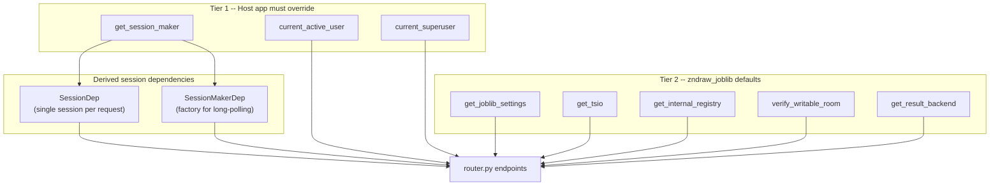

# Architecture

This page explains the internal structure of `zndraw-joblib` and how its
dependency injection design allows host applications to plug it in with
minimal coupling.

## Module Layout

All source lives under `src/zndraw_joblib/`.

| Module | Purpose |
|---|---|
| **router.py** | FastAPI router with all REST endpoints under `/v1/joblib`. The central module handling job registration, task submission/claim/update, worker management, provider reads, and long-polling. |
| **models.py** | SQLAlchemy 2.0 ORM models (`Job`, `Worker`, `Task`, `WorkerJobLink`, `ProviderRecord`) inheriting from `zndraw_auth.Base`. |
| **schemas.py** | Pydantic request/response models including `PaginatedResponse[T]` generic envelope. |
| **client.py** | Synchronous client SDK (`JobManager`, `Extension`, `ClaimedTask`) using `httpx`. Workers subclass `Extension` with a `category` ClassVar and `run()` method. |
| **dependencies.py** | FastAPI dependencies for settings, internal registry, Socket.IO, room validation, and the result backend protocol. Does **not** own database sessions -- uses `SessionDep` from `zndraw_auth`. |
| **settings.py** | `JobLibSettings` using pydantic-settings with `ZNDRAW_JOBLIB_` env prefix. |
| **exceptions.py** | RFC 9457 Problem Details error types (see [Error Handling](#error-handling) below). |
| **sweeper.py** | Background coroutine that periodically cleans up stale workers, orphan jobs, and stuck internal tasks. |
| **events.py** | Socket.IO event models (`FrozenEvent` subclasses) and the `emit()` helper for real-time notifications. |
| **registry.py** | Internal taskiq worker registration (`InternalRegistry`, `InternalExecutor` protocol, `register_internal_jobs()`). |
| **provider.py** | `Provider` base class for server-dispatched read handlers. Host apps subclass it to define typed read requests. |

## Dependency Injection

The package uses a **two-tier** dependency injection design. Tier 1
dependencies come from `zndraw_auth` and _must_ be overridden by the host
app. Tier 2 dependencies are defined within `zndraw-joblib` itself and have
sensible defaults, but can be overridden for customization.

### Tier 1 -- From zndraw_auth (host app must override)

| Dependency | Description |
|---|---|
| `get_session_maker` | Single source of truth for **all** database sessions. Both `SessionDep` (regular endpoints) and `SessionMakerDep` (long-polling endpoints) derive from this one override. |
| `current_active_user` | Authenticated user identity for standard endpoints. |
| `current_superuser` | Superuser access control for admin-only operations. |

### Tier 2 -- From zndraw_joblib (optional overrides)

| Dependency | Default Behavior | Override When |
|---|---|---|
| `get_joblib_settings` | Reads `app.state.joblib_settings`, returns `JobLibSettings`. | You need custom settings beyond env vars. |
| `get_tsio` | Reads `app.state.tsio`, returns `AsyncServerWrapper` or `None`. When `None`, all `emit()` calls become no-ops (real-time disabled). | You have a different Socket.IO setup. |
| `get_internal_registry` | Reads `app.state.internal_registry`, returns `InternalRegistry` or `None`. When `None`, `@internal` job submissions return 503. | You manage the registry differently. |
| `verify_writable_room` | Validates `room_id` format only (no `@` or `:` in user room IDs). | Host app needs lock checks or permission gates. |
| `get_result_backend` | **Raises `NotImplementedError`**. Required for provider endpoints. | Host app must provide a `ResultBackend` implementation (typically Redis). |

### DI Override Flow

The following diagram shows how the host app's single `get_session_maker`
override feeds both session dependency types, and how tier 1 vs. tier 2
dependencies relate.



The key insight: the host app overrides `get_session_maker` **once**, and
every endpoint in the router -- whether it uses `SessionDep` or
`SessionMakerDep` -- automatically picks up the correct session factory. For
SQLite deployments, the host app wraps the session maker with an
`asyncio.Lock` to serialize database access; this single override propagates
to all endpoints.

## Session Patterns

The router uses two distinct patterns for database sessions, chosen based on
the endpoint's lifecycle requirements.

### SessionDep -- Single session per request

Most endpoints (POST, PATCH, and simple GET) inject `SessionDep`, which
provides a single `AsyncSession` scoped to the request lifetime. The session
is created when the dependency is resolved and closed when the response is
sent.

```python
@router.post("/rooms/{room_id}/jobs")
async def register_job(
    session: SessionDep,  # one session, lives for the whole request
    ...
):
    ...
```

### SessionMakerDep -- Factory for long-polling

Long-polling endpoints need to release database connections between poll
iterations so they do not hold a connection for the full wait duration. These
endpoints inject `SessionMakerDep`, which is the `async_sessionmaker` factory
itself. They create short-lived sessions per iteration.

Three endpoints use this pattern:

- **`GET /tasks/{task_id}`** -- Polls for task status changes with `Prefer: wait=N` header.
- **`GET /rooms/{room_id}/providers/{name}`** -- Waits for provider results with `Prefer: wait=N` header.
- **`POST /providers/{provider_id}/results`** -- Validates the provider in a short-lived session, then interacts with the result backend outside any session.

```python
@router.get("/tasks/{task_id}")
async def get_task_status(
    session_maker: SessionMakerDep,  # factory, not a session
    ...
):
    # Each poll iteration opens and closes its own session
    async with session_maker() as session:
        task = await session.get(Task, task_id)
        ...
```

## Error Handling

All errors use **RFC 9457 Problem Details for HTTP APIs**. Each error type is
a subclass of `ProblemType` with `ClassVar` fields for `title` and `status`.
Class names auto-convert to kebab-case URIs via `_camel_to_kebab()`:

```
JobNotFound  -->  /v1/problems/job-not-found
```

The host app registers `problem_exception_handler` to convert
`ProblemException` instances into JSON responses with the
`application/problem+json` media type:

```python
from zndraw_joblib.exceptions import ProblemException, problem_exception_handler

app.add_exception_handler(ProblemException, problem_exception_handler)
```

### Error Types

| Exception | Status | When |
|---|--------|------|
| `JobNotFound` | 404 | Job does not exist or is soft-deleted. |
| `SchemaConflict` | 409 | Re-registering a job with a different schema. |
| `InvalidCategory` | 400 | Category not in `allowed_categories`. |
| `WorkerNotFound` | 404 | Worker does not exist. |
| `TaskNotFound` | 404 | Task does not exist. |
| `InvalidTaskTransition` | 409 | Invalid status transition (e.g., COMPLETED to RUNNING). |
| `InvalidRoomId` | 400 | Room ID contains `@` or `:`. |
| `Forbidden` | 403 | Admin privileges required or wrong resource owner. |
| `InternalJobNotConfigured` | 503 | `@internal` job submitted but no executor registered. |
| `ProviderNotFound` | 404 | Provider does not exist. |
| `ProviderTimeout` | 504 | Provider did not respond within the long-poll timeout. |
