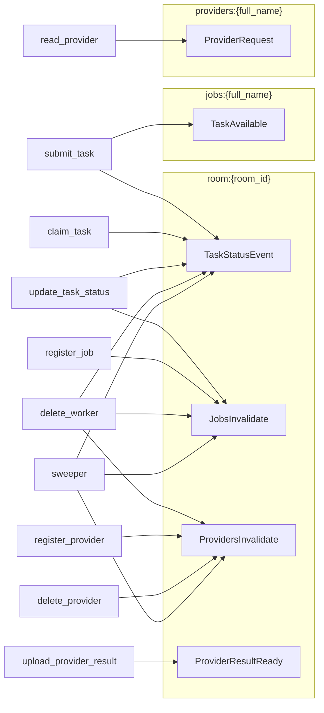

# Events

zndraw-joblib uses Socket.IO for real-time notifications. Events inform
frontends about task status changes, notify workers about new tasks, and
dispatch provider read requests. All event handling is optional -- when
`get_tsio` returns `None`, all emissions are silently skipped.

## Socket.IO Rooms

Socket.IO rooms act as named broadcast channels. Each listener joins one or
more rooms, and the server emits events to a room to reach all listeners in it
simultaneously. zndraw-joblib uses three room naming conventions:

| Room Pattern | Purpose | Listeners |
|---|---|---|
| `room:{room_id}` | Task status updates, job/provider list invalidation | Frontend clients viewing a room |
| `jobs:{full_name}` | New task notifications | Workers registered for that job |
| `providers:{full_name}` | Provider read dispatch | Provider clients serving that provider |

### Room Topology

The following diagram shows which events target which rooms:



## Event Models

All event models are frozen Pydantic `BaseModel` subclasses (via the
`FrozenEvent` base class, which sets `frozen=True` in `model_config`). This
makes them immutable and hashable -- both properties are required by the
emission deduplication system described below.

### Server-to-Client Events (emitted via the Emission system)

These events are emitted by the server after database commits. They are never
sent directly; they flow through the `Emission` set and the `emit()` function.

| Event | Payload | Room | Trigger |
|---|---|---|---|
| `TaskStatusEvent` | `id`, `name`, `room_id`, `status`, `created_at`, `started_at`, `completed_at`, `queue_position`, `worker_id`, `error` | `room:{room_id}` | Any task status transition |
| `TaskAvailable` | `job_name`, `room_id`, `task_id` | `jobs:{full_name}` | Task submitted (non-`@internal` only) |
| `JobsInvalidate` | _(none)_ | `room:{room_id}` | Job registered/deleted, worker connected/disconnected |
| `ProvidersInvalidate` | _(none)_ | `room:{room_id}` | Provider registered/deleted, worker disconnected |
| `ProviderRequest` | `request_id`, `provider_name`, `params` | `providers:{full_name}` | Server dispatches read to provider |
| `ProviderResultReady` | `provider_name`, `request_hash` | `room:{room_id}` | Provider result cached |

`ProviderRequest.params` is stored as a canonical JSON string (sorted keys,
compact separators) rather than a dict. This ensures the frozen model is
hashable while remaining directly usable by Socket.IO clients without
tuple-to-dict conversion. The `from_dict_params()` classmethod handles the
conversion from `dict` to canonical JSON.

### Client-to-Server Events (emitted directly by `JobManager`)

These events are sent by the client SDK over the Socket.IO connection. They
manage room subscriptions so workers receive the correct task notifications
and provider dispatch events.

| Event | Payload | Purpose |
|---|---|---|
| `JoinJobRoom` | `job_name`, `worker_id` | Worker subscribes to task notifications for a job |
| `LeaveJobRoom` | `job_name`, `worker_id` | Worker unsubscribes on disconnect or job unregistration |
| `JoinProviderRoom` | `provider_name`, `worker_id` | Client subscribes to provider dispatch for a provider |
| `LeaveProviderRoom` | `provider_name`, `worker_id` | Client unsubscribes on disconnect or provider unregistration |

The host app's Socket.IO handler is responsible for translating these events
into actual room joins and leaves. For example, on receiving `JoinJobRoom`,
the handler calls `tsio.enter_room(sid, f"jobs:{event.job_name}")` and stores
the `worker_id` in the Socket.IO session for disconnect cleanup.

## Emission System

Events are not emitted immediately during request processing. Instead, they
are accumulated in a `set[Emission]` during the transaction, then emitted in a
batch after the database commit succeeds.

### The `Emission` NamedTuple

An `Emission` is a `NamedTuple` of `(event: FrozenEvent, room: str)`. Because
`FrozenEvent` models are frozen (and therefore hashable), the set
automatically deduplicates identical emissions.

```python
class Emission(NamedTuple):
    event: FrozenEvent
    room: str
```

### Accumulate-then-emit Pattern

Every endpoint that needs to send events follows the same pattern:

```python
emissions: set[Emission] = set()

# ... modify database state ...
emissions.add(Emission(TaskStatusEvent(...), f"room:{room_id}"))
emissions.add(Emission(JobsInvalidate(), f"room:{room_id}"))

await session.commit()
await emit(tsio, emissions)  # no-op if tsio is None
```

Some endpoints start with an initial set and accumulate additional emissions
from helper functions. For example, `update_task_status` merges in orphan-job
cleanup emissions:

```python
orphan_emissions = await _soft_delete_orphan_job(session, task.job_id)

await session.commit()

emissions: set[Emission] = {await _task_status_emission(session, task)}
emissions |= orphan_emissions
await emit(tsio, emissions)
```

### Why This Design

**Emit after commit.** Events reflect committed state, not in-progress
transactions. If the commit fails (constraint violation, serialization error,
etc.), no events are emitted. Clients never receive notifications about state
that does not exist in the database.

**Set deduplication.** Multiple code paths may produce the same event. For
example, `cleanup_worker` fails multiple tasks that may all belong to the same
room -- but only one `JobsInvalidate` per room is needed. Because
`JobsInvalidate()` is frozen and stateless, adding it to the set multiple
times with the same room string is a no-op. The deduplication is automatic and
requires no bookkeeping from the caller.

**Batch emission.** All events for a single request are sent together after
the commit, reducing Socket.IO overhead compared to emitting inline during
database mutations.

## The `emit()` Function

```python
async def emit(
    tsio: AsyncServerWrapper | None,
    emissions: set[Emission],
) -> None:
```

If `tsio` is `None`, the function returns immediately. Otherwise, it iterates
over the emission set and calls `tsio.emit(event, room=room)` for each pair.
The Pydantic model is passed directly to the `zndraw-socketio` wrapper, which
handles serialization.

### When `tsio` is None

The `get_tsio` dependency reads `app.state.tsio` and returns `None` if the
attribute is not set. This makes real-time notifications entirely optional.
Tests typically run without Socket.IO, and the router works identically -- all
`emit()` calls become no-ops. No conditional logic is needed at the call
sites because the `None` check is inside `emit()` itself.

## Helper: `build_task_status_emission()`

Building a `TaskStatusEvent` from a `Task` ORM object requires looking up the
job's full name and computing the queue position. The
`build_task_status_emission()` function encapsulates this:

```python
def build_task_status_emission(
    task: Task,
    job_full_name: str,
    queue_position: int | None = None,
) -> Emission:
```

It constructs a `TaskStatusEvent` from the task's fields and wraps it in an
`Emission` targeting `room:{task.room_id}`. The router's
`_task_status_emission()` async helper adds the database lookups (job name,
queue position) on top of this.

Both the router and the sweeper use `build_task_status_emission()` to produce
consistent `TaskStatusEvent` emissions without duplicating the field mapping
logic.

## Event Flow Examples

### Task Submission (remote worker)

1. `submit_task` creates a PENDING task and commits.
2. Emits `TaskStatusEvent` to `room:{room_id}` (frontend sees the new task).
3. Emits `TaskAvailable` to `jobs:{full_name}` (workers wake up and attempt
   to claim).

### Task Submission (`@internal`)

1. `submit_task` creates a PENDING task, dispatches to taskiq, transitions to
   CLAIMED, and commits.
2. Emits `TaskStatusEvent` to `room:{room_id}`.
3. **No** `TaskAvailable` emission -- internal tasks are not claimed by remote
   workers.

### Worker Disconnect

1. `delete_worker` (or the sweeper) fails all CLAIMED/RUNNING tasks owned by
   the worker.
2. Removes worker-job links, deletes providers, soft-deletes orphan jobs.
3. Commits the transaction.
4. Emits `TaskStatusEvent` for each failed task, `JobsInvalidate` for each
   affected room, and `ProvidersInvalidate` for rooms that lost providers.
5. The set deduplication ensures at most one `JobsInvalidate` per room, even
   if the worker served multiple jobs in the same room.

### Provider Read

1. `read_provider` checks the result cache. On miss, it dispatches a
   `ProviderRequest` to `providers:{full_name}`.
2. The provider client receives the event, calls `provider.read(handler)`,
   and uploads the result via `POST /providers/{id}/results`.
3. `upload_provider_result` stores the result, notifies long-poll waiters via
   the result backend, and emits `ProviderResultReady` to
   `room:{room_id}` so frontends can refresh.
