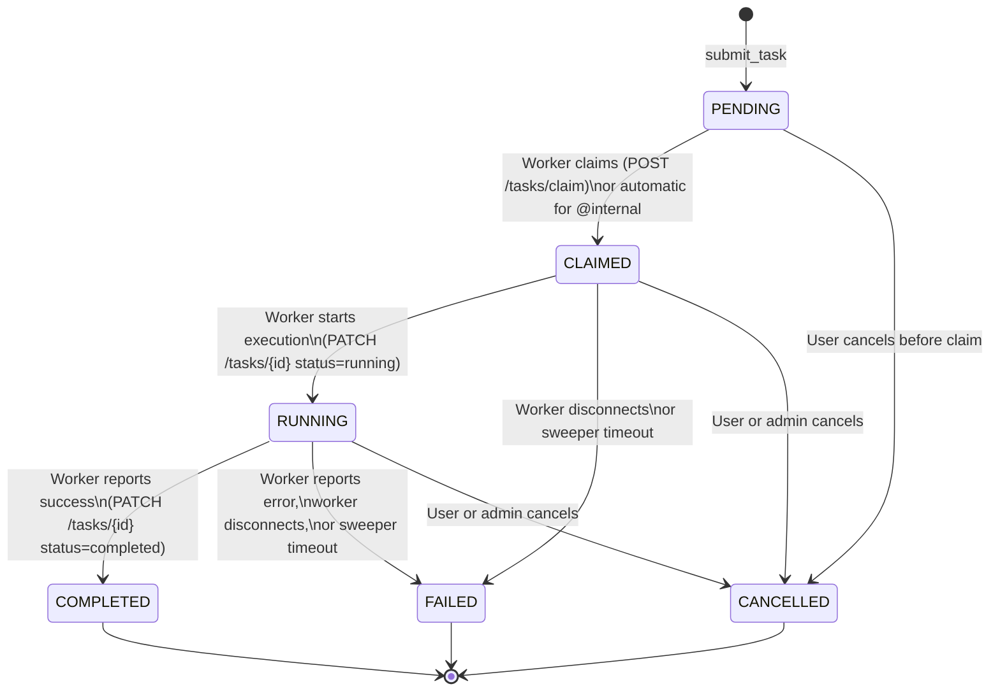
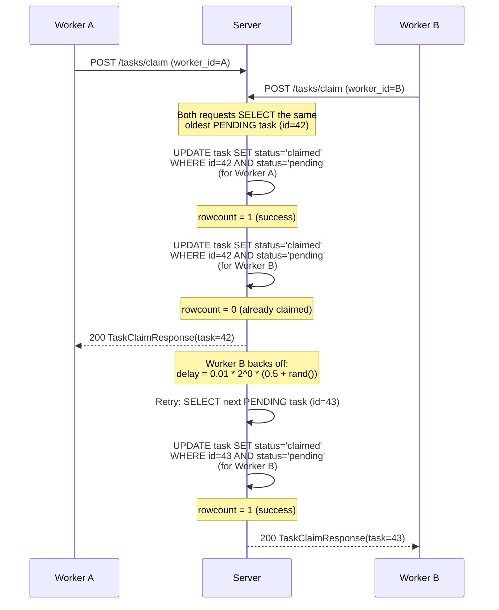

# Jobs and Tasks

Jobs define _what_ can be executed; tasks are individual _invocations_ of a job.
A job is a named, schema-validated function registered by a worker (or the server
itself for internal jobs). A task carries a payload through a state machine from
submission to completion.

## Job Naming

Every job has a **full name** built from three colon-delimited parts:

```
{room_id}:{category}:{name}
```

For example: `@global:modifiers:Rotate`, `room_42:analysis:RDF`, `@internal:modifiers:CenterAtoms`.

### Room Types

| Room ID      | Scope                    | Who can register             |
|--------------|--------------------------|------------------------------|
| `@global`    | Visible to **all** rooms | Superuser only               |
| `@internal`  | Server-side taskiq jobs, never claimed by remote workers | Superuser only |
| Any other string (e.g. `room_123`) | Room-scoped, visible only from that room | Any authenticated user |

### Validation Rules

- **`@` is reserved.** Regular room IDs cannot contain `@`. The `validate_room_id()`
  dependency enforces this, raising a `400 Bad Request` (RFC 9457 `InvalidRoomId`) for
  any room ID containing `@` or `:` that is not exactly `@global` or `@internal`.
- **`:` is the delimiter.** Room IDs cannot contain `:` either, since that would make
  the full name ambiguous.
- **Category allow-list.** The category must appear in `settings.allowed_categories`
  (default: `modifiers`, `selections`, `analysis`). Unrecognized categories return
  `400 Bad Request` (`InvalidCategory`).
- **Schema conflict.** If a job with the same `(room_id, category, name)` tuple
  already exists and is active, the incoming schema must match exactly. A mismatch
  returns `409 Conflict` (`SchemaConflict`). Different rooms can register the same
  `category:name` combination with different schemas.

### Database Constraint

Jobs are stored with a `UniqueConstraint("room_id", "category", "name")` on the `job`
table. The composite index on `(room_id, category, name)` enforces uniqueness at the
database level.

## Soft Deletion

Jobs are **never hard-deleted**. When a job loses all its workers and has no pending
tasks, the sweeper (or the task-update endpoint) marks it `deleted=True`. This
preserves the full task history for completed, failed, and cancelled tasks.

Re-registering a soft-deleted job reactivates it (`deleted=False`) and replaces the
schema with the one provided in the new registration request.

`@internal` jobs are exempt from orphan cleanup -- they are registered at server
startup and remain active regardless of worker count.

## Task Lifecycle

Each task progresses through a state machine. Terminal states are final -- no further
transitions are allowed.



### Valid Transitions

The server enforces the transition matrix defined in `router.py`:

| From        | Allowed targets                           |
|-------------|-------------------------------------------|
| `PENDING`   | `CLAIMED`, `CANCELLED`                    |
| `CLAIMED`   | `RUNNING`, `FAILED`, `CANCELLED`          |
| `RUNNING`   | `COMPLETED`, `FAILED`, `CANCELLED`        |
| `COMPLETED` | _(none -- terminal)_                      |
| `FAILED`    | _(none -- terminal)_                      |
| `CANCELLED` | _(none -- terminal)_                      |

Any invalid transition returns `409 Conflict` (`InvalidTaskTransition`).

### Who Triggers Each Transition

| Transition              | Triggered by                                                                 |
|-------------------------|-----------------------------------------------------------------------------|
| PENDING -> CLAIMED      | `POST /tasks/claim` (remote worker) or automatic on submit for `@internal` jobs |
| PENDING -> CANCELLED    | `PATCH /tasks/{id}` with `status=cancelled` (user or superuser)              |
| CLAIMED -> RUNNING      | `PATCH /tasks/{id}` with `status=running` (claiming worker)                  |
| CLAIMED -> FAILED       | Sweeper (worker heartbeat timeout) or `PATCH /tasks/{id}` (worker)           |
| CLAIMED -> CANCELLED    | `PATCH /tasks/{id}` with `status=cancelled` (user or superuser)              |
| RUNNING -> COMPLETED    | `PATCH /tasks/{id}` with `status=completed` (worker)                         |
| RUNNING -> FAILED       | `PATCH /tasks/{id}` with `status=failed` (worker), or sweeper on disconnect  |
| RUNNING -> CANCELLED    | `PATCH /tasks/{id}` with `status=cancelled` (user or superuser)              |

### Timestamps

- `created_at` -- set when the task row is inserted (PENDING).
- `started_at` -- set when the task transitions to RUNNING.
- `completed_at` -- set when the task reaches any terminal state (COMPLETED, FAILED, CANCELLED).

## Optimistic Locking (Task Claiming)

Multiple remote workers may compete to claim the same pending task. The server uses
**optimistic locking** via an atomic SQL UPDATE to resolve the race without
database-level row locks.

### Algorithm

When a remote worker calls `POST /tasks/claim`, the server:

1. **SELECT** the oldest PENDING task for the worker's registered jobs, using the
   composite index `(job_id, status, created_at)`.
2. **UPDATE** atomically:
   ```sql
   UPDATE task
   SET status = 'claimed', worker_id = :worker_id
   WHERE id = :task_id AND status = 'pending'
   ```
3. **Check `rowcount`**: if 1, the claim succeeded. If 0, another worker claimed it
   between the SELECT and UPDATE.
4. **On failure**, apply exponential backoff with jitter and retry:
   ```
   delay = base_delay * 2^attempt * (0.5 + random())
   ```
   Default: `base_delay = 0.01s` (10 ms), up to `claim_max_attempts = 10` retries.
5. After all retries are exhausted, return `TaskClaimResponse(task=None)` -- no task
   was available.

### Race Condition Sequence



### SQLite Considerations

For SQLite deployments, database-level locking is a host app concern. The host app
wraps the session maker with an `asyncio.Lock` to serialize all DB access, preventing
`OperationalError: database is locked`. The claim loop catches `OperationalError`
explicitly and retries with the same backoff strategy.

## Internal Job Dispatch (`@internal`)

For `@internal` jobs, the task does not enter the normal remote-worker claim flow.
Instead, the server dispatches execution to a taskiq broker.

### Flow

1. **Validation.** `submit_task` checks that the `InternalRegistry` (stored on
   `app.state.internal_registry`) has a registered executor for this job's full name.
   If not, returns `503 Service Unavailable` (`InternalJobNotConfigured`).
2. **Create Task row.** Inserts the task with `status=PENDING`.
3. **Dispatch to broker.** Calls `task_handle.kiq(task_id, room_id, payload)` to
   enqueue the task on the taskiq broker (e.g. Redis).
4. **On dispatch failure:** marks the task `FAILED` immediately with
   `error = "Failed to dispatch to internal executor"`.
5. **On dispatch success:** transitions the task to `CLAIMED`. The server takes
   responsibility for execution -- no remote worker will attempt to claim it.
6. **No `TaskAvailable` event.** The Socket.IO `TaskAvailable` emission is skipped
   because no remote workers need to be notified.

The taskiq worker process (which may run in a separate container) consumes from the
broker and invokes the registered `InternalExecutor` callback with the extension class,
payload, room ID, and task ID.

### Stuck Task Cleanup

The sweeper periodically runs `cleanup_stuck_internal_tasks()`, which fails any
`@internal` task stuck in RUNNING or CLAIMED longer than
`settings.internal_task_timeout_seconds` (default: 3600s / 1 hour). These tasks are
marked FAILED with `error = "Internal worker timeout"`.

## Queue Position

Pending tasks include a `queue_position` field that tells clients how many tasks are
ahead of theirs in the queue for the same job. It is computed via an SQL window
function:

```sql
ROW_NUMBER() OVER (PARTITION BY job_id ORDER BY created_at ASC)
```

This partitions pending tasks by job and orders them by creation time, so the oldest
pending task for a given job has `queue_position = 1`, the next has `2`, and so on.

Tasks that are not in the PENDING state have `queue_position = null` -- the field is
only meaningful while waiting in the queue.

## Long-Polling (`GET /tasks/{id}`)

Clients can poll for task completion using the `Prefer: wait=N` header (RFC 7240).
When specified:

1. The server checks if the task is already in a terminal state. If so, returns
   immediately.
2. Otherwise, it polls the database at increasing intervals (starting at 1s, growing
   by 1.5x, capped at 5s) until the task reaches a terminal state or the wait time
   expires.
3. The effective wait is capped by `settings.long_poll_max_wait_seconds` (default: 60).
4. The response includes a `Preference-Applied: wait=N` header confirming the
   effective wait time.

The endpoint uses a **session factory** (not the request-scoped session) to create
short-lived sessions per poll iteration, avoiding holding a database connection open
for the entire wait period.
