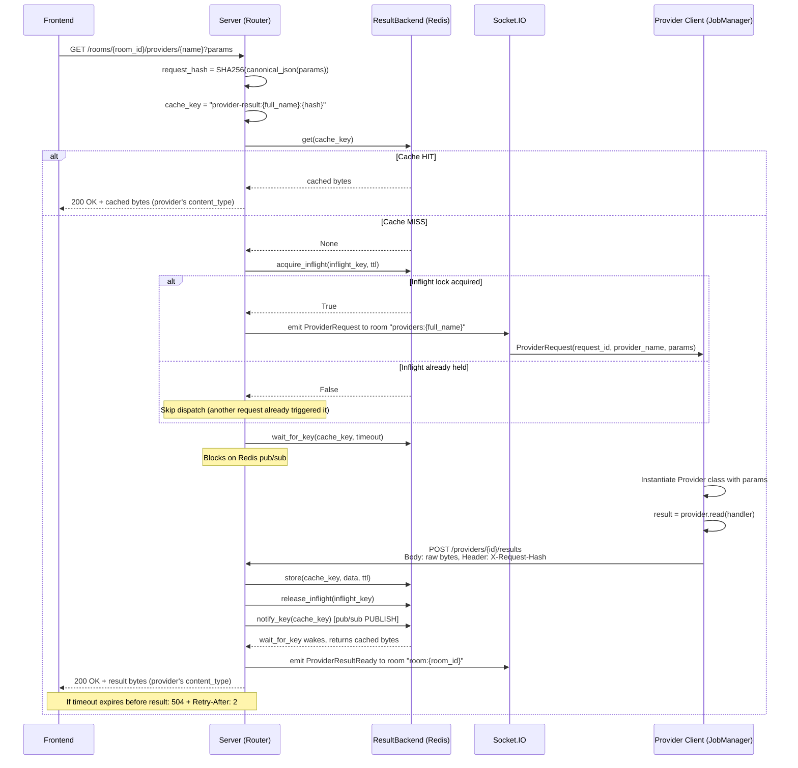
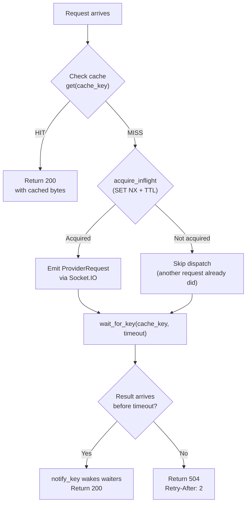

# Providers

Providers are a separate abstraction from jobs. While jobs handle
user-initiated computation (workers pull tasks via FIFO claiming), providers
handle **server-dispatched read requests** with result caching. A provider
answers the question "give me this data" rather than "run this computation."

## Jobs vs. Providers

| | Jobs | Providers |
|---|---|---|
| Purpose | User-initiated computation | Remote resource access |
| Dispatch | Workers pull/claim (FIFO) | Server pushes to specific provider via SIO |
| Results | Side effects (modify room state) | Data returned to caller (cached) |
| Formats | JSON payloads | JSON or binary (msgpack, arrow, etc.) |
| HTTP pattern | POST creates task, PATCH updates | GET reads resource -- 200 (cached) or 202 (dispatched) |
| Communication | REST only (claim loop) | SIO for dispatch, REST for result upload |

Jobs are fire-and-forget from the caller's perspective: a frontend submits a
task and the worker modifies room state as a side effect. Providers are
request/response: the caller blocks (long-polls) until the provider returns
data, and that data is cached so subsequent identical requests return
instantly.

## Provider Read Flow

The read flow is the most complex interaction pattern in the system. It
combines REST endpoints, a Redis-backed result cache, inflight coalescing
via `SET NX`, Socket.IO dispatch, and pub/sub-based long-polling.



### Step-by-step breakdown

1. **Frontend** sends `GET /rooms/{room_id}/providers/{name}?params` to
   the server.
2. **Server** computes `request_hash = SHA256(canonical_json(params))` using
   `dependencies.request_hash()`. The canonical form is
   `json.dumps(params, sort_keys=True, separators=(",", ":"))`.
3. **Server** builds `cache_key = "provider-result:{full_name}:{hash}"` and
   checks `result_backend.get(cache_key)`.
4. **Cache HIT**: return `200` with the cached bytes and the provider's
   declared `content_type`.
5. **Cache MISS**: attempt `result_backend.acquire_inflight(inflight_key, ttl)`
   using Redis `SET NX` semantics.
6. **If inflight acquired**: emit a `ProviderRequest` event to the SIO room
   `providers:{full_name}`.
7. **If inflight NOT acquired** (another request already dispatched for this
   hash): skip dispatch.
8. **Server** calls `result_backend.wait_for_key(cache_key, timeout)`, which
   blocks on Redis pub/sub.
9. **Provider client** receives the `ProviderRequest` via its SIO connection
   (handled by `JobManager._on_provider_request`).
10. **Provider client** instantiates the `Provider` subclass with the decoded
    params and calls `provider.read(handler)`.
11. **Provider client** sends `POST /providers/{id}/results` with the raw
    result bytes and an `X-Request-Hash` header.
12. **Server** stores the result in the cache, releases the inflight lock, and
    calls `notify_key(cache_key)` to publish a pub/sub notification.
13. **Server** emits `ProviderResultReady` to `room:{room_id}` so the
    frontend can refresh its UI.
14. The `wait_for_key` call wakes up and returns the cached data. The server
    responds with `200` and the result bytes.
15. **If timeout**: return `504 Gateway Timeout` with RFC 9457 Problem Details
    and a `Retry-After: 2` header.

## Inflight Coalescing

Multiple concurrent requests with identical params must not dispatch multiple
`ProviderRequest` events. The inflight lock (`acquire_inflight` with Redis
`SET NX` + TTL) ensures only the first request triggers a dispatch. All
concurrent requests block on the same `cache_key` via `wait_for_key()`.



The inflight TTL (`provider_inflight_ttl_seconds`, default 30s) acts as a
safety net: if the provider client crashes or the Socket.IO message is lost,
the lock expires and a subsequent request can re-dispatch. The result cache
TTL (`provider_result_ttl_seconds`, default 300s) controls how long cached
results remain valid.

## ResultBackend Protocol

The host app must provide a `ResultBackend` implementation (typically
Redis-backed) by overriding the `get_result_backend` dependency. The
protocol is defined in `dependencies.py`:

| Method | Signature | Purpose |
|---|---|---|
| `store` | `async (key: str, data: bytes, ttl: int) -> None` | Store bytes in cache with expiration (seconds). |
| `get` | `async (key: str) -> bytes \| None` | Retrieve cached bytes, or `None` if not present. |
| `delete` | `async (key: str) -> None` | Remove a cached entry. |
| `acquire_inflight` | `async (key: str, ttl: int) -> bool` | Atomic set-if-not-exists with TTL (Redis `SET NX`). Returns `True` if the lock was acquired. |
| `release_inflight` | `async (key: str) -> None` | Release the inflight lock. |
| `wait_for_key` | `async (key: str, timeout: float) -> bytes \| None` | Subscribe to pub/sub, check cache (race-safe), wait for notification or timeout. Returns cached data or `None`. |
| `notify_key` | `async (key: str) -> None` | Publish notification that the key is populated, waking all `wait_for_key` waiters. |

### Race safety in wait_for_key

The `wait_for_key` implementation must be **race-safe**: subscribe to the
notification channel FIRST, then check the cache, then wait. This prevents
the race where a result arrives between the cache check and the subscribe:

```
WRONG (race-prone):           CORRECT (race-safe):
1. check cache -> miss        1. subscribe to channel
2. result arrives + notify    2. check cache -> miss
3. subscribe to channel       3. wait for notification
4. wait forever (missed it)   4. result arrives + notify -> wakes up
```

If step 2 in the correct sequence finds a cache hit, `wait_for_key` returns
immediately without waiting.

## Content Types

Each `Provider` subclass declares its response format via the
`content_type` ClassVar (default `"application/json"`). This value is stored
in the `ProviderRecord` database row at registration time.

- **JSON providers**: `read()` returns a Python object. The client
  JSON-serializes it (`json.dumps(result).encode()`), uploads the bytes, and
  the server returns them with `media_type="application/json"`.
- **Binary providers**: `read()` returns `bytes` directly. The client uploads
  the raw bytes as-is, and the server returns them with the provider's
  declared `content_type` (e.g., `application/x-msgpack`, `image/png`).

The result upload endpoint (`POST /providers/{id}/results`) stores the raw
request body with no parsing or re-serialization. The server is
content-type-agnostic -- it passes bytes through from the provider client
to the frontend caller.

```python
class FilesystemRead(Provider):
    category: ClassVar[str] = "filesystem"
    content_type: ClassVar[str] = "application/json"
    path: str

    def read(self, handler: Any) -> Any:
        # Return value is JSON-serialized by the client
        return handler.cat(self.path)


class ThumbnailProvider(Provider):
    category: ClassVar[str] = "thumbnails"
    content_type: ClassVar[str] = "image/png"
    frame: int

    def read(self, handler: Any) -> bytes:
        # Return raw bytes for binary content types
        return handler.render_thumbnail(self.frame)
```

## Provider Registration

Providers are registered via `PUT /rooms/{room_id}/providers` with a schema,
content_type, and worker_id. The endpoint is idempotent -- it updates the
existing record if one already exists for the same `(room_id, category, name)`
tuple.

On the client side, `manager.register_provider(cls, name=..., handler=..., room=...)`
performs the following steps:

1. **Generate JSON schema** from the `Provider` subclass via
   `cls.model_json_schema()`.
2. **PUT to server** with the schema, `content_type`, and optional
   `worker_id`. If no `worker_id` is provided, the server auto-creates a
   `Worker` record.
3. **Emit `JoinProviderRoom`** via Socket.IO, which causes the host app to
   add the client's SIO session to the room `providers:{full_name}`. Future
   `ProviderRequest` events emitted to this room will reach this client.
4. **Store the handler locally** in `JobManager._providers` keyed by
   `full_name`. When a `ProviderRequest` arrives, the handler is passed to
   `provider.read(handler)`.

```python
manager.register_provider(
    FilesystemRead,
    name="local",
    handler=fsspec.filesystem("file"),
    room="@global",
)
# Registers as @global:filesystem:local
# handler is passed to FilesystemRead(...).read(handler) on dispatch
```

### The handlers property

The `handlers` property on `JobManager` returns all registered handlers keyed
by `full_name`:

```python
manager.handlers
# {"@global:filesystem:local": <filesystem object>, ...}
```

This dict is typically passed into `Extension.run()` during job execution, so
extensions can look up provider handlers by name to read data during their
computation.

## Provider Lifecycle on the Client

When a `ProviderRequest` arrives via Socket.IO, `JobManager._on_provider_request`
handles it synchronously:

1. Look up the `_RegisteredProvider` by `event.provider_name`.
2. Deserialize `event.params` (a canonical JSON string) into a dict.
3. Instantiate the `Provider` subclass with the params as keyword arguments.
4. Call `instance.read(handler)` to produce the result.
5. Serialize: JSON providers get `json.dumps(result).encode()`, binary
   providers pass `result` through as-is.
6. Upload via `POST /providers/{id}/results` with the `X-Request-Hash` header.

If `read()` raises an exception, the error is logged and a chat message is
posted to the provider's room (best-effort). The inflight lock eventually
expires, allowing a retry.

## Configuration

Provider behavior is controlled by `JobLibSettings` fields with the
`ZNDRAW_JOBLIB_` env prefix:

| Setting | Default | Description |
|---|---|---|
| `allowed_provider_categories` | `None` (unrestricted) | When set, only listed categories can be registered. |
| `provider_result_ttl_seconds` | `300` | How long cached results remain valid (seconds). |
| `provider_inflight_ttl_seconds` | `30` | TTL for the inflight deduplication lock (seconds). |
| `provider_long_poll_default_seconds` | `5` | Default long-poll timeout when no `Prefer: wait=N` header is sent. |
| `provider_long_poll_max_seconds` | `30` | Maximum allowed long-poll timeout regardless of `Prefer` header value. |

## Error Handling

Provider endpoints use the same RFC 9457 Problem Details system as the rest
of the router:

| Error | Status | When |
|---|---|---|
| `ProviderNotFound` | 404 | Provider does not exist or is not visible from the requested room. |
| `ProviderTimeout` | 504 | Provider did not respond within the long-poll timeout. Includes `Retry-After: 2` header. |
| `Forbidden` | 403 | Provider belongs to a different user (registration/upload/delete). |
| `InvalidCategory` | 400 | Provider category not in `allowed_provider_categories`. |
| `WorkerNotFound` | 404 | Specified `worker_id` does not exist or is not owned by the user. |

On the client side, `ProviderTimeoutError` (defined in `exceptions.py`) can
be raised from `ProviderTimeout.raise_for_client()` when the client detects a
504 response.
