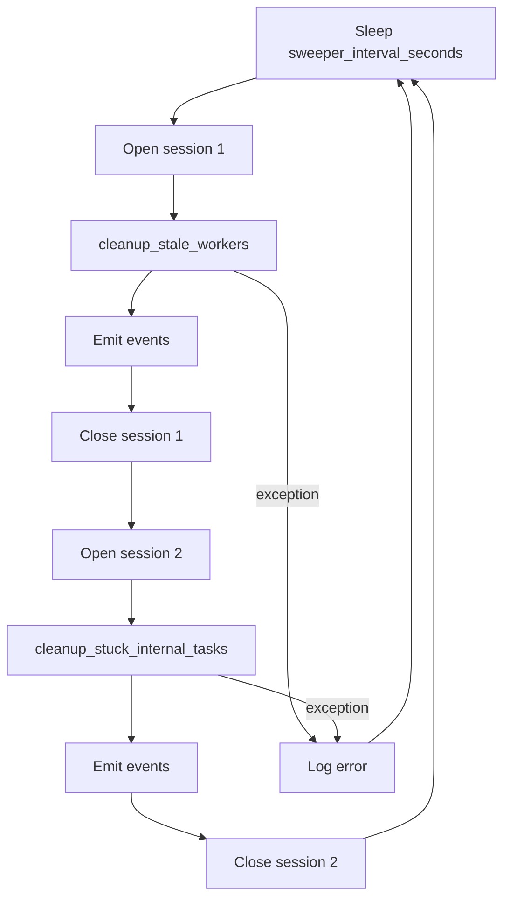
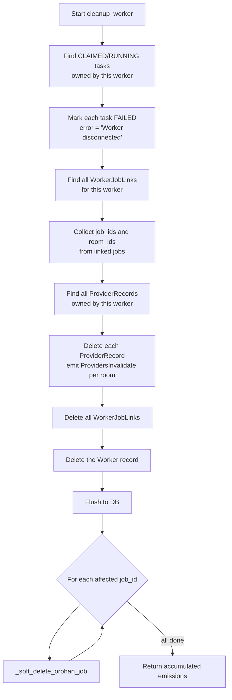

# Sweeper

The background sweeper keeps the system healthy by cleaning up stale workers, soft-deleting orphan jobs, and failing stuck internal tasks. Without it, workers that crash or lose network connectivity would leave behind claimed tasks and dangling job registrations indefinitely.

## Overview

The sweeper is a background asyncio coroutine (`run_sweeper()`) that the host app starts explicitly. It runs on a fixed interval and performs three cleanup operations in sequence, each with its own fresh database session.

## Sweeper Loop

The host app creates the sweeper as a background task during startup:

```python
asyncio.create_task(
    run_sweeper(get_session=my_session_factory, settings=settings, tsio=tsio)
)
```

`get_session` is an async generator that yields `AsyncSession` instances. The sweeper calls it twice per cycle -- once for stale worker cleanup and once for stuck internal task cleanup -- so each operation gets its own session and transaction boundary.

Each cycle:

1. Sleep for `sweeper_interval_seconds` (default 30s)
2. Clean up stale workers (external)
3. Emit accumulated Socket.IO events from step 2
4. Clean up stuck internal tasks (`@internal`)
5. Emit accumulated Socket.IO events from step 4
6. Log any errors but continue running



The `try`/`except` wraps the entire body of the loop. If any step raises, the error is logged and the sweeper continues to the next cycle. The sweeper never exits unless the event loop is shut down.

## Stale Worker Cleanup

`cleanup_stale_workers(session, timeout)` queries for workers where `last_heartbeat < now - worker_timeout_seconds` (default 60s).

For each stale worker found, it calls `cleanup_worker(session, worker)` -- the same function used by the graceful disconnect path and Socket.IO disconnect handler. After processing all stale workers, it commits once (batching all changes in a single transaction).

### cleanup_worker Cascade

`cleanup_worker()` performs a multi-step cascade for a single worker. It does NOT commit -- the caller is responsible for committing the transaction. This allows batching multiple worker cleanups into one atomic operation.



The accumulated emissions include:

- `TaskStatusEvent` for each task that was moved to FAILED
- `JobsInvalidate` for each room that had affected jobs (worker count changed)
- `ProvidersInvalidate` for each room that had providers deleted

## Orphan Job Soft-Deletion

After a worker is removed, `_soft_delete_orphan_job(session, job_id)` checks each affected job to determine whether it should be soft-deleted.

A job is soft-deleted (`deleted=True`) only if ALL of these conditions are true:

- The job is **not** `@internal` -- server-managed jobs are never auto-deleted because they are re-registered at startup.
- The job has **no remaining workers** -- checked via `WorkerJobLink`. If another worker still serves this job, it stays active.
- The job has **no pending tasks** -- pending tasks could be picked up by a new worker that registers later, so the job must remain visible.

If any condition is false, the job stays active and no changes are made. Soft-deleted jobs retain their task history and can be reactivated when a new worker registers the same `(room_id, category, name)` tuple.

## Stuck Internal Task Cleanup

`cleanup_stuck_internal_tasks(session, timeout)` targets `@internal` tasks (those dispatched to taskiq workers) that are stuck in `RUNNING` or `CLAIMED` beyond `internal_task_timeout_seconds` (default 3600s = 1 hour).

The reference time for staleness is `COALESCE(started_at, created_at)`:

| Task status | Reference column | Rationale |
|---|---|---|
| `RUNNING` | `started_at` | The task began execution; timeout measures actual run duration |
| `CLAIMED` | `created_at` | The task was dispatched but never started; `started_at` is NULL |

Stuck tasks are marked `FAILED` with `error = "Internal worker timeout"` and a `completed_at` timestamp. If any tasks were failed, the session is committed and a count is logged.

This cleanup only applies to `@internal` jobs. External worker tasks that are stuck are handled by the stale worker cleanup (if the worker's heartbeat lapses) or remain in their current state if the worker is still alive.

## Three Disconnect Paths

The sweeper is the fallback for workers that do not disconnect gracefully. The system provides three paths for cleaning up a worker, all converging on the same `cleanup_worker()` function:

| Path | Trigger | Latency | Mechanism |
|---|---|---|---|
| Graceful | Client calls `disconnect()` or context manager exit | Immediate | `DELETE /workers/{id}` --> `cleanup_worker()` |
| SIO disconnect | Network drop detected by Socket.IO | Seconds | Host app's SIO disconnect handler --> `cleanup_worker()` |
| Sweeper | No heartbeat received within timeout | Up to `worker_timeout_seconds` | Sweeper periodic scan --> `cleanup_stale_workers()` --> `cleanup_worker()` |

Because all three paths use `cleanup_worker()`, the behavior is identical regardless of how the worker disappears: tasks are failed, links are removed, providers are deleted, and orphan jobs are soft-deleted.

## Configuration

All settings are controlled via `JobLibSettings` (environment prefix `ZNDRAW_JOBLIB_`):

| Setting | Default | Purpose |
|---|---|---|
| `sweeper_interval_seconds` | 30 | How often the sweeper wakes up and runs its cleanup cycle |
| `worker_timeout_seconds` | 60 | How long since the last heartbeat before a worker is considered stale |
| `internal_task_timeout_seconds` | 3600 | Maximum time an `@internal` task can remain in `RUNNING` or `CLAIMED` before being force-failed |

The worker timeout should be at least 2x the client's heartbeat interval to avoid false positives from transient network delays. The sweeper interval should be shorter than the worker timeout so that stale workers are detected within one timeout period.
