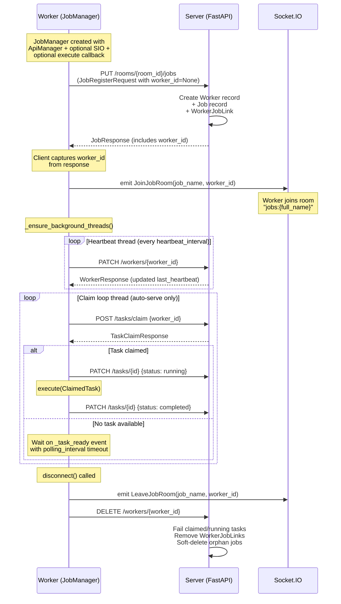
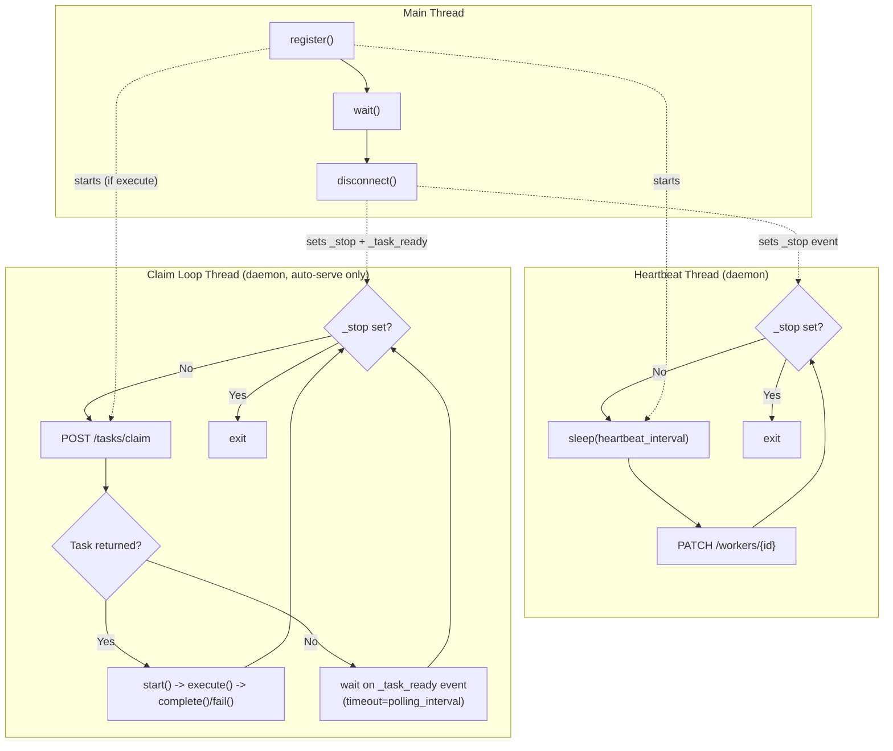

# Workers

## Overview

Remote workers are external Python processes that use the `JobManager` client SDK to:

1. Register `Extension` classes as jobs on the server
2. Claim and execute tasks
3. Send heartbeats to stay alive
4. Disconnect gracefully or be cleaned up by the sweeper

Workers communicate with the server via REST (`httpx`) and optionally Socket.IO (for real-time task notifications). All HTTP calls go through an `ApiManager` protocol object that handles authentication headers and error responses.

## Worker Lifecycle

The full lifecycle of a remote worker, from creation through task execution to shutdown:



## Auto-Serve vs Manual Mode

### Auto-serve (execute callback provided)

When an `execute` callback is provided to `JobManager`, two daemon threads start automatically on the first `register()` call:

- **Heartbeat thread** -- sends `PATCH /workers/{id}` every `heartbeat_interval` seconds (default 30s)
- **Claim loop thread** -- continuously claims tasks via `POST /tasks/claim`, transitions them through `start() -> execute(ClaimedTask) -> complete()`, and on exception calls `fail(task, error)`

```python
def my_execute(task: ClaimedTask) -> None:
    task.extension.run(vis)

with JobManager(api, tsio, execute=my_execute) as manager:
    @manager.register
    class Rotate(Extension):
        category: ClassVar[Category] = Category.MODIFIER
        angle: float = 0.0

        def run(self, vis, **kwargs):
            # extension logic
            ...

    manager.wait()  # blocks until SIGINT/SIGTERM
```

### Manual mode (no execute callback)

Only the heartbeat thread runs. The caller uses `claim()` for single claims or `listen()` as a generator:

```python
with JobManager(api, tsio) as manager:
    @manager.register
    class Rotate(Extension):
        category: ClassVar[Category] = Category.MODIFIER
        angle: float = 0.0

        def run(self, vis, **kwargs):
            ...

    for task in manager.listen(polling_interval=2.0):
        manager.start(task)
        try:
            task.extension.run(vis)
            manager.complete(task)
        except Exception as e:
            manager.fail(task, str(e))
```

### Threading Model



## Socket.IO Wakeup vs Polling

When Socket.IO is connected, the server broadcasts a `TaskAvailable` event to the `jobs:{full_name}` room whenever a task is submitted. The client's `_on_task_available` handler sets the `_task_ready` threading.Event, immediately waking the claim loop from its sleep.

Without Socket.IO (or if the event is lost), the claim loop falls back to polling every `polling_interval` seconds (default 2s). No tasks are missed -- the next poll iteration will find the pending task. The only difference is latency.

The claim loop logic:

1. Call `POST /tasks/claim`
2. If a task is returned, execute it immediately and loop back to step 1
3. If no task is available, call `_task_ready.wait(timeout=polling_interval)`
4. If `_task_ready` was set by a Socket.IO event, the wait returns immediately
5. If the timeout expires, loop back to step 1 (polling fallback)

## Worker Auto-Creation

Workers can be created in two ways:

**Explicit creation** via `create_worker()`:

```python
worker_id = manager.create_worker()  # POST /workers
```

**Implicit creation** during `register()`: if `worker_id` is `None` in the `JobRegisterRequest`, the server auto-creates a `Worker` record linked to the authenticated user and returns its ID in the `JobResponse`. The client captures this ID and reuses it for all subsequent `register()` calls.

In both cases, the server creates:

- A `Worker` row linked to the authenticated user's ID
- A `WorkerJobLink` row connecting the worker to each registered job

Multiple jobs can share the same worker. The claim endpoint (`POST /tasks/claim`) finds the oldest pending task across all jobs linked to that worker.

## Graceful vs Abrupt Shutdown

### Graceful shutdown

Using the context manager (`with manager:`) or receiving SIGINT/SIGTERM triggers `disconnect()`, which executes in order:

1. Sets `_stop` event to signal threads to exit their loops
2. Sets `_task_ready` to wake the claim loop if it is sleeping
3. Joins all threads with a 10s timeout (waits for in-flight tasks to finish)
4. Emits `LeaveProviderRoom` / `LeaveJobRoom` via Socket.IO
5. Sends `DELETE /workers/{id}` -- the server fails claimed/running tasks, removes `WorkerJobLink` rows, and soft-deletes orphan jobs
6. Clears local registry state

The `wait()` method blocks on the `_stop` event. When called from the main thread, it installs `SIGINT`/`SIGTERM` handlers that call `disconnect()` and restores the original handlers on exit.

### Abrupt shutdown

When a worker process is killed without cleanup (e.g., `kill -9`, OOM, network partition):

- Daemon threads die with the process
- The worker's heartbeat timestamp stops updating
- The server-side sweeper detects the stale heartbeat after `worker_timeout_seconds` (default 60s)
- The sweeper calls `cleanup_worker()`: fails tasks, removes links, soft-deletes orphan jobs
- If Socket.IO was connected, the server-side disconnect handler can trigger immediate cleanup (this is a host app responsibility)

### Disconnect Scenarios

| Scenario | Handler | Latency |
|---|---|---|
| Graceful shutdown (`with manager:`) | Client `disconnect()` -> `DELETE /workers/{id}` | Immediate |
| SIGINT / SIGTERM | Signal handler -> `disconnect()` | Immediate |
| Network drop with Socket.IO | Server-side SIO disconnect handler | Seconds |
| Process kill / REST-only worker | Sweeper heartbeat timeout | Up to `worker_timeout_seconds` (default 60s) |

## ApiManager Protocol

The host application must provide an object matching the `ApiManager` protocol to `JobManager`. This decouples the worker SDK from any specific authentication or HTTP client configuration:

```python
class ApiManager(Protocol):
    http: httpx.Client

    def get_headers(self) -> dict[str, str]: ...

    @property
    def base_url(self) -> str: ...

    def raise_for_status(self, response: httpx.Response) -> None: ...
```

| Member | Purpose |
|---|---|
| `http` | Thread-safe `httpx.Client` instance for all REST calls |
| `get_headers()` | Returns auth headers (e.g., `{"Authorization": "Bearer <token>"}`) |
| `base_url` | Server base URL (e.g., `https://app.example.com`) |
| `raise_for_status(response)` | Error handling strategy -- raise on non-2xx, log, or custom logic |

The `JobManager` calls `api.get_headers()` on every request, so token refresh logic can be implemented transparently inside `get_headers()`.

## Server-Side Cleanup

When the server receives `DELETE /workers/{id}` (or the sweeper detects a stale worker), the `cleanup_worker()` function in `sweeper.py` performs:

1. **Fail active tasks** -- all tasks in `CLAIMED` or `RUNNING` status owned by the worker are transitioned to `FAILED` with error `"Worker disconnected"`
2. **Remove links** -- all `WorkerJobLink` rows for the worker are deleted
3. **Delete providers** -- all `ProviderRecord` rows owned by the worker are deleted
4. **Delete worker** -- the `Worker` row itself is removed
5. **Orphan job cleanup** -- for each job that was linked to the worker, check if the job has zero remaining workers and zero pending tasks; if so, soft-delete it (set `deleted=True`)

All of this happens within a single transaction. Socket.IO emissions (`JobsInvalidate`, `TaskStatusEvent`, `ProvidersInvalidate`) are sent after commit to notify connected frontends.
