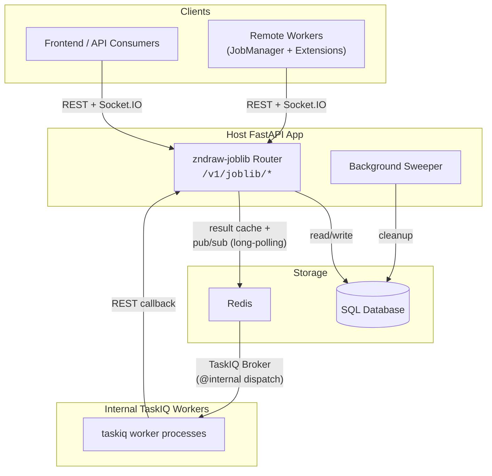

# zndraw-joblib

`zndraw-joblib` is a self-contained FastAPI package for distributed job/task management with SQL persistence. It provides a pluggable router, ORM models, a client SDK, and a background sweeper -- designed to be mounted into a host FastAPI app via dependency injection overrides. The host app owns database sessions, authentication, and Socket.IO; `zndraw-joblib` consumes these through FastAPI's dependency system, keeping the package decoupled and testable in isolation.

## Architecture Overview

**Frontend / API Consumers** submit tasks and poll for results through the REST API and receive real-time status updates over Socket.IO.

**Remote Workers** use the client SDK (`JobManager` + `Extension` subclasses) to register jobs, claim tasks via Socket.IO events, and report results back through REST.

**Redis** serves two distinct roles: it acts as the **TaskIQ broker** for dispatching `@internal` jobs to server-side worker processes, and as the **result backend** for provider response caching and pub/sub notifications that power long-polling.

**The Background Sweeper** runs inside the host app, periodically cleaning up stale workers, orphaned jobs, and stuck internal tasks.

## Key Concepts

| Concept | Description |
|---------|-------------|
| [Architecture & Dependency Injection](concepts/architecture.md) | How `zndraw-joblib` plugs into a host app -- session factories, auth overrides, and `app.state` conventions. |
| [Jobs & Tasks](concepts/jobs-and-tasks.md) | Job naming (`{room_id}:{category}:{name}`), the task lifecycle (`PENDING` through `COMPLETED`/`FAILED`/`CANCELLED`), concurrency control, and optimistic locking. |
| [Workers](concepts/workers.md) | Remote worker registration, heartbeats, the `Extension` base class, and the threading model used by `JobManager.serve()`. |
| [Providers](concepts/providers.md) | Server-dispatched read requests, the `Provider` base class, result caching in Redis, and long-polling semantics. |
| [Events](concepts/events.md) | Socket.IO event model -- `TaskAvailable`, `JobsInvalidate`, `ProvidersInvalidate`, and room-based routing. |
| [Sweeper](concepts/sweeper.md) | Background cleanup of stale workers, orphaned jobs, and stuck `@internal` tasks. |

## Integration Guide

Ready to mount `zndraw-joblib` into your own FastAPI application? See the [Integration Guide](integration.md) for step-by-step setup instructions covering dependency overrides, database migration, Redis configuration, and sweeper startup.
